  

        

 

 

---

Hi, I'm CHT. I graduated from The Hong Kong Polytechnic University. I am a product manager and interest-driven developer exploring AI agents, software, and data analytics through open-source projects.

I like starting with a real problem: a repetitive action, a vague product question, or a workflow that keeps losing context. I turn it into a product, then use code and data to make it tangible and testable.

This profile follows three lines of work. Every repository begins with a concrete problem and carries my product judgment about trade-offs, evidence, and what the product could become.

| 
Line of work
 | 
What I care about
 |
|---|---|
| **Agents** | Combine reusable context, tools, and judgment around repeatable workflows |
| **Software development** | Remove recurring friction with small, usable tools |
| **Data analytics** | Make assumptions, costs, failures, and decisions inspectable |

---

  

I build agent systems around workflows that benefit from reusable context, tools, and judgment.

| 
Project
 | 
Product idea
 |
|---|---|
| &nbsp;[**grill-powers**](https://github.com/okht/grill-powers) | Join Grill Me and Superpowers so product design, technical design, and build stay staged, and mid-build product changes re-enter through Grill Me |
| &nbsp;[**desktop-organizer**](https://github.com/okht/desktop-organizer) | Organize Windows folders through a dry-run, explicit approval, safe moves, and verification |

<strong>grill-powers</strong> — Product manager from idea to accept.

 

I built `grill-powers` after using Superpowers on product work and watching product questions mix with technical ones. Without an engineering background, it is hard to tell which answers are product decisions. Each new technical option can reopen scope, so the requirement list grows and rarely shrinks.

The skill joins Grill Me and Superpowers with hard stage gates. Grill Me settles product decisions one at a time and freezes an approved product spec. Superpowers owns technical design, the plan, build, review, and fresh checks. If design or coding finds a real product change, work pauses, returns to Grill Me, and re-walks approve → spec → plan before resume.

I want it to serve product managers and solo builders who need Agents for delivery without giving up product control when scope shifts mid-build.

<strong>desktop-organizer</strong> — See every move before anything moves.

 

I built `desktop-organizer` from my own need to clean a Windows Desktop filled with documents, screenshots, installers, archives, and code projects. Manual sorting required repeated decisions, while direct automation introduced the risks of misclassification, overwrites, and unintended file operations.

The workflow is inspect, plan, approve, execute, and verify. Its default mode only prints a dry-run; moving requires explicit approval. It does not delete or overwrite, conflicts stop execution early, shortcuts and system files stay in place, uncertain items enter a review inbox, and all work remains local.

I want it to serve heavy Windows Desktop users and develop into a personalized classification system where people can keep their own taxonomy, rules, and exception lists.

I build focused tools around problems I have actually encountered.

| 
Project
 | 
Product idea
 |
|---|---|
| [**clip-md**](https://github.com/okht/clip-md) | Save valuable AI responses to local Markdown in one click, without breaking the current train of thought |
| [**gmail-inbox-system-public**](https://github.com/okht/gmail-inbox-system-public) | Turn Gmail into a cautious hub for multiple inboxes with composable labels and guarded archiving |
| [**okx-btc-daily-report-public**](https://github.com/okht/okx-btc-daily-report-public) | Recalculate the BTC DCA metrics I care about from read-only trades and deliver them by email |
| [**majsoul-windows-daily-login**](https://github.com/okht/majsoul-windows-daily-login) | Keep a paid Mahjong Soul monthly pass from going to waste with a quiet daily open on Windows, without a login bot |

<strong>clip-md</strong> — Copy what matters. Keep it as Markdown.

 

I built `clip-md` after repeatedly feeling friction when saving useful AI content. ChatGPT, Claude, and other tools often produce answers worth keeping, and I wanted those answers to become part of my local knowledge base. The old flow required an editor, a new file, a destination, a filename, and a final save. That sequence was long enough to interrupt the thought I was trying to preserve.

I reduced the core interaction to one small action: copy text, use the control that appears near the pointer, and save it directly as local Markdown. Automatic naming is another deliberate choice. The app extracts keywords and uses a fallback chain when extraction is weak, removing one more decision while keeping files readable and searchable.

I want `clip-md` to serve frequent AI users and knowledge workers. Its direction is deliberately lightweight: improve reliability, platform fit, signed distribution, and the quiet details that let a desktop tool stay useful for a long time.

<strong>gmail-inbox-system-public</strong> — One inbox, several meanings, controlled automation.

 

I built Gmail Inbox System after routing several mailboxes into Gmail. Switching decreased, but the inbox began to lose source and action semantics. App notifications, bills, security alerts, personal messages, and pending work arrived in one stream, while the old labels mixed source, content type, and status in ways that became harder to maintain over time.

I separated the label system into composable dimensions: application, type, source, and status each express one meaning. A message can preserve where it came from, what it contains, and what action it needs. Classification, preview, retention windows, and protection rules form explicit gates around archiving, while uncertain mail remains visible.

I want this system to become my personal email hub, with Gmail as the unified entrance and AI-generated daily briefings as a future layer. The public repository contains reusable, privacy-conscious rules and examples; it contains no private messages, account credentials, or access to my live mailboxes.

<strong>okx-btc-daily-report-public</strong> — My DCA strategy, measured on my terms.

 

I built OKX BTC Daily Report because I follow my own BTC DCA strategy. The exchange's built-in plan did not match the rules and cadence I wanted, and its fixed dashboard could not answer the questions I cared about, such as 30-day performance, planned versus actual investment, and the result after fills and fees.

The workflow reads trade data through read-only access and recalculates daily, 7-day, 30-day, and cumulative views with my own definitions. Split fills, fees, and quote currencies make manual tracking drift over time, so the rules need to run consistently. I chose email delivery because the report should arrive inside an existing routine without asking me to maintain another dashboard.

I want it to develop into a personal investment data console covering more assets, time windows, metrics, and visual views. The public repository is a sanitized reference implementation: it contains no API keys, cannot see my OKX account, and does not execute trades.

<strong>majsoul-windows-daily-login</strong> — Don't waste the monthly pass.

 

I built `majsoul-windows-daily-login` after buying a Mahjong Soul monthly pass and watching it go to waste. Work and study kept the day full, so the daily check-in was easy to miss even when I intended to open the client. The product problem was not “play more”; it was stop leaking value I had already paid for, with as little daily attention as possible.

I first tried to bind the habit to the phone, because that is the device I touch most often. I dropped that path: iOS is a poor fit for this kind of local automation, and I did not want a cloud bot that logs in, clicks, or handles captchas for me. Windows became the practical surface. The scheduled path reuses a dedicated Edge profile, opens the official client in a local morning window, confirms the lobby with read-only fingerprints and accessible text, and never synthesizes input. After success it dwells briefly and exits. Optional mail fires only on failure or a manual block; a healthy day stays silent.

I want this to remain a private, low-interrupt tool for my own routine. The public repository is the implementation and its boundaries—not a growth product, and not an attempt to look more human than a plain daily open.

I use analysis to challenge intuition, record uncertainty, and make decisions easier to revisit.

> The investment and trading projects document personal research. They do not provide financial advice.

| 
Project
 | 
Product idea
 |
|---|---|
| [**quant-research**](https://github.com/okht/quant-research) | A reusable research framework that records assumptions, costs, failed experiments, and validation limits |
| [**crypto-trading-research**](https://github.com/okht/crypto-trading-research) | Test whether active BTC strategies add enough value to justify their cost and effort against long-term holding |
| [**ecommerce-user-analysis**](https://github.com/okht/ecommerce-user-analysis) | Turn historical transactions into customer segments and growth hypotheses through RFM and K-Means |
| [**ai-chat-analytics**](https://github.com/okht/ai-chat-analytics) | Link conversation behavior, issue attribution, and follow-up signals to AI product priorities |

<strong>quant-research</strong> — Keep the evidence, including the failures.

 

I built `quant-research` to turn investment ideas into hypotheses that data can challenge. A strategy can sound reasonable and still rely on one favorable period. I want to see which data it used, how it formed signals, where returns came from, and how much survives when windows, parameters, and models change.

I pay particular attention to overfitting and fragmented research chains. Parameter searches can produce attractive in-sample results, while code, data, and temporary outputs slowly lose their connection. I keep weak factors, failed models, and degraded strategies, and I evaluate costs, attribution, drawdown, and out-of-sample behavior alongside return. A failed experiment still tells me which path lacks durable evidence.

I want `quant-research` to become a reusable framework for snapshots, hypotheses, signals, backtests, validation, and recorded findings. New markets and models can then enter the same structure, making personal research cumulative, comparable, and reviewable.

<strong>crypto-trading-research</strong> — Can active BTC trading earn its complexity?

 

I built `crypto-trading-research` around a question that directly affects my own decisions: after fees, slippage, turnover, and attention are counted, is long-term BTC holding already the lowest-cost and lowest-effort strategy? Active trading and machine learning can look sophisticated, but complexity alone does not prove additional value.

I use long-term holding as the persistent baseline, then test classic indicators, statistical signals, and machine-learning models against it. Costs are explicit because frequent turnover can erase a paper advantage. Windows and fee assumptions remain visible, and model metrics still need to become real strategy returns. MA, RSI, Bollinger Bands, and XGBoost experiments remain in the repository even when their results are weak.

I want the project to become a BTC decision evidence base that keeps testing the same question across new data and market regimes. Every conclusion stays attached to its sample window, cost assumption, and validation method so another learner can review the whole path.

<strong>ecommerce-user-analysis</strong> — See the customers hidden inside aggregate metrics.

 

I built `ecommerce-user-analysis` to understand how transaction records become meaningful customer segments. Revenue, order count, and average order value describe the whole business, but they compress differences between loyal customers, drifting customers, promising newcomers, and people who need a different strategy.

I use RFM to create an interpretable business segmentation, then K-Means to inspect the natural structure in the data. Together they preserve a clear operating language while adding a second analytical view. The project moves from more than one million historical transactions through cleaning, exploration, segmentation, and visualization, then turns the result into retention, reactivation, and conversion hypotheses.

I want it to develop into an e-commerce growth analytics console that tracks how segments change, which metrics matter for each group, and what growth experiments actually change behavior.

<strong>ai-chat-analytics</strong> — Turn conversational signals into product priorities.

 

I built `ai-chat-analytics` because likes, dislikes, retries, and follow-ups do not directly tell an AI product team what to fix first, why users are dissatisfied, or whether an improvement changed the experience. Broad labels such as general quality can locate a problem while still leaving the cause unclear.

I split the work into synthetic data generation, behavior analysis, issue attribution, follow-up signals, and insight summarization. A fixed seed makes the public snapshot reproducible without exposing real conversations. Transparent keyword rules establish an explainable baseline and expose their own limit: 71.2% of current bad cases still fall into a catch-all label, and manual validation remains incomplete.

I want the project to serve AI product leaders and grow into an AI experience monitoring console, with continuous metrics, attribution quality, alerts, and experiment results connected in one place.

---

        

